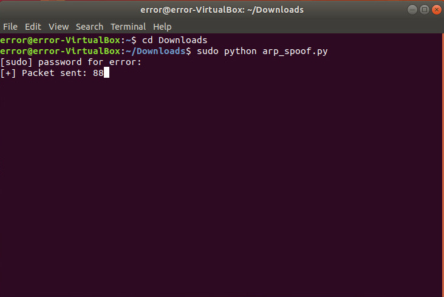
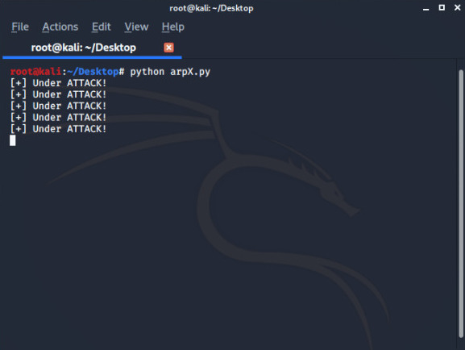

# ARP SPOOF DETECTOR

ARP poisoning can be detected in several different ways, you can use tools or you can monitor your **ARP** table by using the command "arp-a"  and if the table contains two different IP addresses that share the same MAC address, then you are probably undergoing an ARP poisoning attack, but you can't check tables everytime so it' better to use any tool or my code. 


## RUN


1. Clone the repo 

```bash
root@kali:~# git clone https://github.com/Error-200/Hack-X.git

```
2. Change the dir 

```bash
root@kali:~#  cd Hack-X
root@kali:~/Hack-X#  cd arpX

```
3. Run the python code 

```bash
root@kali:~/Hack-X/arpX# python arpX.py
```

### Screenshots 

> For testing you can run our **arp_spoof** code to do an ARP spoofing on a device.


> Run the **arpX** code on target device:



### Build 

- Python 
- Python modules used
  - [scapy](https://scapy.readthedocs.io/en/latest/extending.html)
