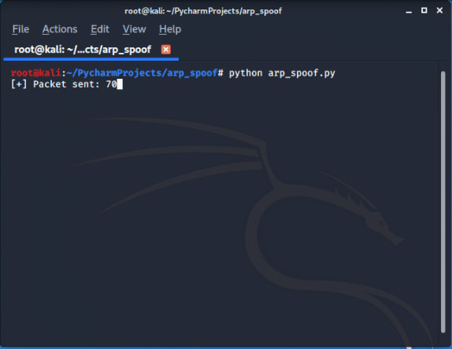
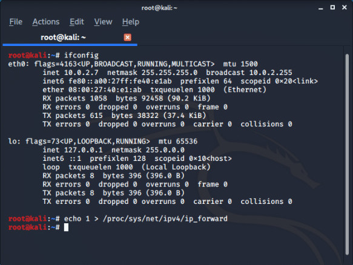
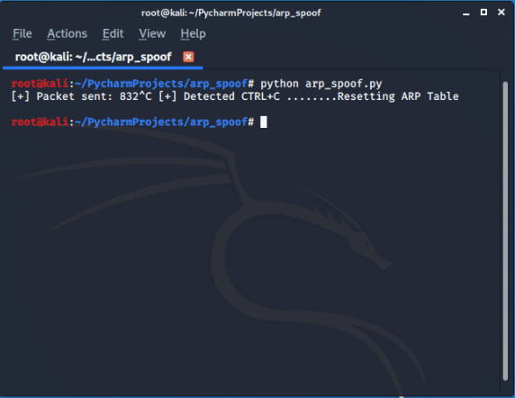

# ARP SPOOFER


In computer networking, ARP spoofing, ARP cache poisoning, or ARP poison routing, is a technique by which an attacker sends (spoofed) Address Resolution Protocol (ARP) messages onto a local area network. Generally, the aim is to associate the attacker's MAC address with the IP address of another host, such as the default gateway, causing any traffic meant for that IP address to be sent to the attacker instead.
ARP spoofing may allow an attacker to intercept data frames on a network, modify the traffic, or stop all traffic. Often the attack is used as an opening for other attacks, such as denial of service, man in the middle, or session hijacking attacks.....[Wikipedia](https://en.wikipedia.org/wiki/ARP_spoofing)

---

## Run 

1. Clone the repo 

```bash
root@kali:~# git clone https://github.com/Error-200/Hack-X.git

```
2. Change the dir 

```bash
root@kali:~#  cd Hack-X
root@kali:~/Hack-X# cd arp_spoofer

```

3. Open the code "arp_spoof.py" in any editor and set this two fields : 

```python

target_ip =  ""
gateway_ip = ""

```

To get **gateway_ip**

```bash
root@kali:~#  route -n 

```
To select a **target_ip** you can scan all networks you can use  **airodump-ng** , **netdiscover** ... any other tool or you can use our **network_Scanner code**

After setting (for example):

```python

target_ip =  "10.0.2.14"
gateway_ip = "10.0.2.1"

```
Save the code 
3. Run the code 
```bash
root@kali:~/Hack-X/arp_spoofer# python arp_spoof.py
```



>When your machine becomes router for victim and when recives an request it stops them flowing  to the router which is  default security feature built in *KALI* in order to enable port forwarding fix this issue run the below command(in different tab).

```
root@kali:~# echo 1 > /proc/sys/net/ipv4/ip_forward

```


Once you quit the program it will reset the **arp tables**


