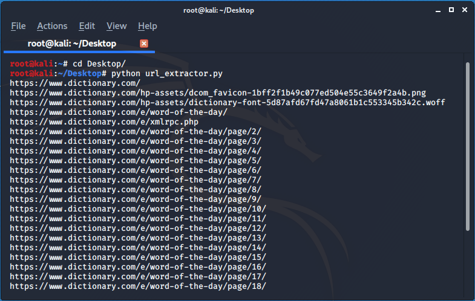

# WEB CRAWLER (to extract sitemap)


**This crawler can  extract all links from a website it can genrate the entire sitemap for any website**


## Run

1. Clone the repo 

```bash
root@kali:~# git clone https://github.com/Error-200/Hack-X.git

```
2. Change the dir 

```bash
root@kali:~#  cd Hack-X
root@kali:~/Hack-X# cd crawler
root@kali:~/Hack-X/crawler# cd sitemap
root@kali:~/Hack-X/crawler/cd sitemap#

```

3. Open the <code> spidy.py</code>  in your editor and set the fields : 

> set your target_url: 

```python

target_url = "enter_your_target_url_here"

```
4. Execute the code 

```bash

root@kali:~/Hack-X/crawler/cd sitemap# python spidy.py

```

## SCREENSHOT



### BUILD 

- Python
- Python modules used 
  - [requests](https://requests.readthedocs.io/en/master/)
  - [re](https://docs.python.org/3/library/re.html)
  - [urlparse](https://docs.python.org/2/library/urlparse.html)
