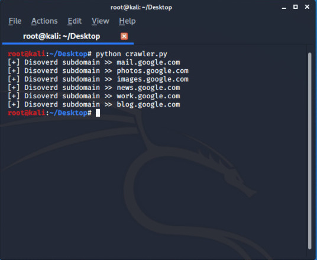

# WEB CRAWLER ( to guess possible subdomains)

**This crawler can guess and extract all possible subdomains with the help of a wordlist.**


## Run

1. Clone the repo 

```bash
root@kali:~# git clone https://github.com/Error-200/Hack-X.git

```
2. Change the dir 

```bash
root@kali:~#  cd Hack-X
root@kali:~/Hack-X# cd  crawler
root@kali:~/Hack-X/crawler# cd subdomain
root@kali:~/Hack-X/crawler/subdomain#

```

3. Open the <code> subdomain.py</code>  in your editor and set the fields : 

> set your target_url: 
```python

#excluding http/https
target_url = "enter_your_target_url_here"

```
> and set the wordlist location on machine :
```python
with open("enter_your_wordlist_location", "r") as wordlist_file:

```
4. Once done with the fields just execute the code 

```bash

root@kali:~/Hack-X/crawler# python subdomain.py 

```

## SCREENSHOT


### BUILD 

- Python
- Python modules used 
  - [requests](https://requests.readthedocs.io/en/master/)
