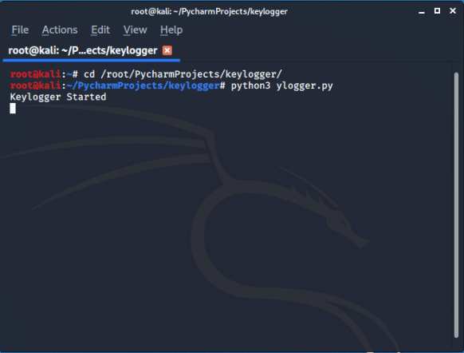

# KEYLOGGER


A keylogger, sometimes called a keystroke logger or system monitor, is a type of surveillance technology used to monitor and record each keystroke typed on a specific computer's keyboard.Keyloggers are often used as a spyware tool, this keylogger can record each keystroke typed on a the computer's and sends a report to your email at an certain interval of time.


## RUN


1. Clone the repo 

```bash
root@kali:~# git clone https://github.com/Error-200/Hack-X.git

```
2. Change the dir 

```bash
root@kali:~#  cd Hack-X
root@kali:~/Hack-X# cd keylogger
```
3. Open the code "ylogger.py" in any editor and set the required fields : 

```python
my_kelogger = keylogger.Keylogger(120, "enter your emailID", "enter your password")

```
> By default time interval is set to **2 mins** change according to your comfort.

4. Save the code for testing purpose you can run the code on your own machine

```bash
root@kali:~# python3 ylogger.py
```

### Screenshot

After running the code you will recive an mail that kelogger is started depending on the interval you set it will send the report.




## BUILD
- python3 
- python modules used 

  -[smtp](https://docs.python.org/3/library/smtplib.html)
  
  -[pynput](https://pynput.readthedocs.io/en/latest/keyboard.html)
  
  -[thread](https://docs.python.org/2/library/thread.html)
