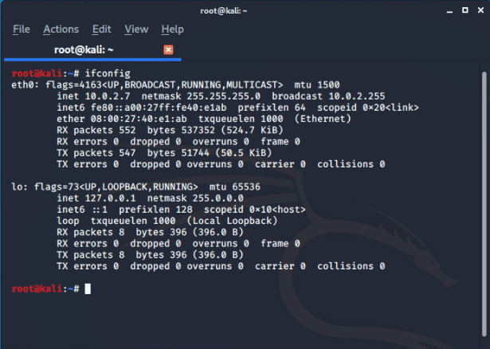
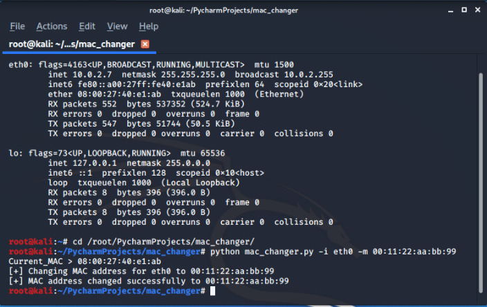
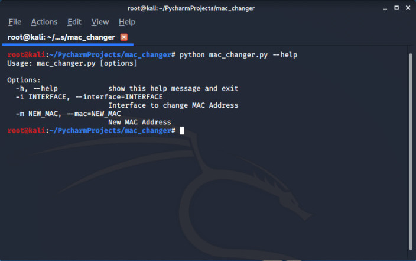

## MAC CHANGER (Python script to change MAC Address of device)

MAC stands for <mark> Media Access Control </mark> which is :

- Unique
- Permanent
- Physical and **Assigned By Manufacturer**

 **So why we need to change our MAC Adress ?**


- Increase Anonmity
- Impersonate other device
- ByPass Filters

## Run 
---

Clone the repo 

```bash
root@kali:~# git clone
```

Change the dir 

```bash
root@kali:~# cd Hack-X
root@kali:~# cd mac_chnager

```
Run this command 

```
root@kali:~# python mac_changer.py -i eth0 -m 11:22:33:44:55:66

```

> -i (interface ) : set according to you wlan0/eth0
> -m (mac address) : set what you want
---

## Screenshot
---





For Help

```bash
root@kali:~# python mac_changer.py --help

```


## BUILD WITH 
---

- Python
- Python modules used

  - [subprocess](https://docs.python.org/3/library/subprocess.html)
  - [optparse](https://docs.python.org/3/library/optparse.html)
  - [re](https://docs.python.org/3/library/re.html)
