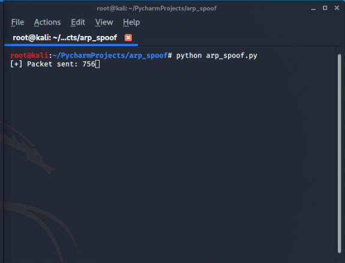
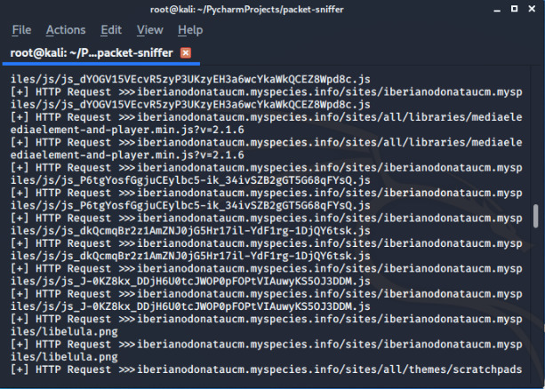

# PACKET SNIFFER (HTTP)

Packet sniffing is the practice of gathering, collecting, and logging some or all packets that pass through a computer network, regardless of how the packet is addressed. In this way, every packet, or a defined subset of packets, may be gathered for further analysis.
Packet sniffing is done by using tools called packet sniffer. It can be either filtered or unfiltered. Filtered is used when only specific data packets have to be captured and Unfiltered is used when all the packets have to be captured. WireShark, SmartSniff are examples of packet sniffing tools.
This packet sniffer can sniff possible login info and urls details over HTTP network accessed by your target user. 


## RUN 


1. Clone the repo 

```bash
root@kali:~# git clone https://github.com/Error-200/Hack-X.git

```
2. Change the dir 

```bash
root@kali:~#  cd Hack-X
root@kali:~/Hack-X#  cd packet_sniffer

```

**By default the interface is set to **eth0** change according to your use.**

3. After becoming **main in the middle** through any attack you can use the packet_sniffrer :


```bash
root@kali:~# python packet_sniffer.py

```

### SCREENSHOT

To become **man in the middle** you can use our **arp_spoofer** tool to do an arp_spoofing 


Once you become man in the middle run the packet sniffer to it will capture packets over HTTP network 



### BUILD WITH 

- Python
- Python modules used 

  - [scapy](https://scapy.readthedocs.io/en/latest/)
  - [scapy_http](https://scapy.readthedocs.io/en/latest/layers/http.html)
